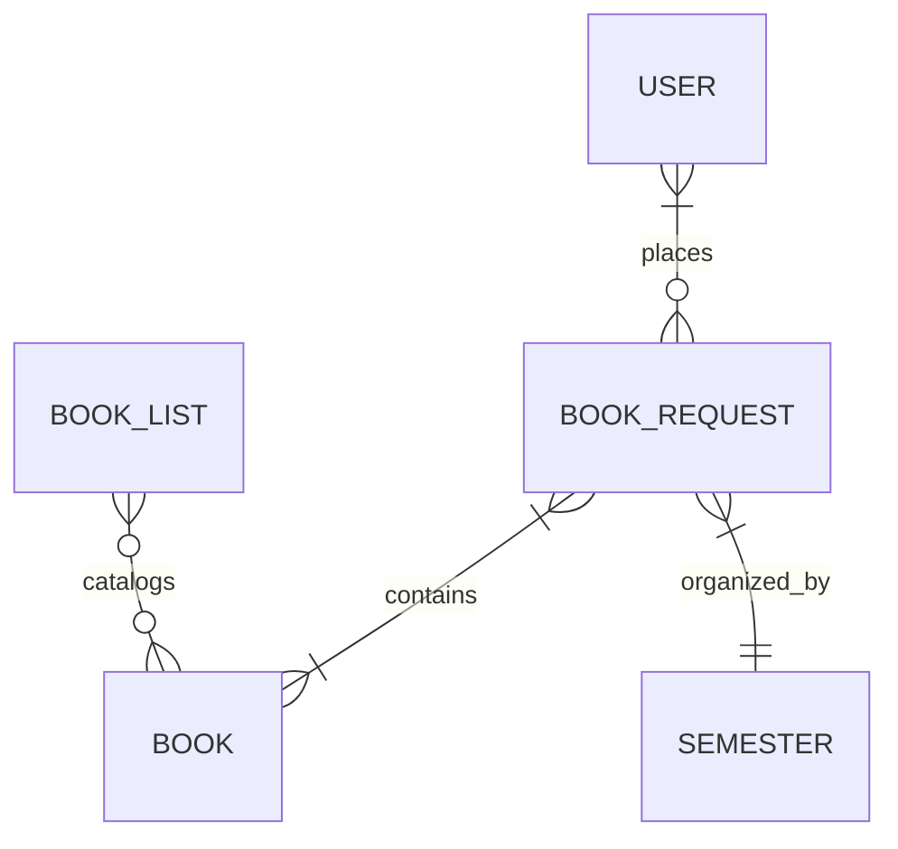

 

# COP4710 Team 13:
# Book Procurement Center

## Getting Started
Thank you for downloading the UCF Book Procurement site. This website was crafted using a drupal 8 stack, which is composed of:
* Nginx
* PHP-FPM
* MariaDB

Due to this, you will need to complete the following steps in order to get your website up and running:

1. First, [please install Docker.](https://www.docker.com/products/docker-desktop) This environment will allow you to create an area where you can initialize the database and website.

2. After downloading the .zip file and extracting onto your desired directory, open the **Stack** folder directory on your preferred terminal and enter `$docker compose up -d` like so:

 


3. Now enter `$docker ps`; this will show you the containers you have just created. You will notice that there are 3 containers. We only need to interact with the container called `stack-db-1` for the purposes of initializing our website. To the far right in the table, you will see the name of the container and the far left will have the Container ID; copy the container ID.

4. To shell into the container, enter `$docker exec -it {CONTAINER ID HERE} bash`. 

5. Then, enter `$mariadb cop4710 -u team13 -p` to establish connection with your MariaDB database. This will prompt you to enter a password. You can find this password in the `mariadb-password.txt` under the **secrets** folder. Simply copy and paste all of its contents to the given prompt.

 

6. Give MariaDB a few seconds to start running, and then [press the following link.](http://localhost:8080/init.php) This is `http://localhost:8080/init.php`, which will initialize our website on your browser. Then, [press this link.](http://localhost:8080/login.php) This is is `http://localhost:8080/login.php` which will take you to the website proper, with everything set to go.


7. The database is already populated with an admin account so you can get started immediately. 

### Super Admin
#### e-mail: super_admin@team13.cop4710.ucf.edu
#### password: TMJW3q4R5Fx8X8S9FC2h2jajDw1t2T86gkc4AHq48VYqh3cm

8. You are now all set up and ready to go! **Enjoy!!**


## The Website: Broken Down
In the Main Menu, you can an Admin Panel since you will first log in as an Admin.

 


This is known as the **Admin Panel**, and regular users will not have this visible to them upon logging in. To better visualize the page flow, below is a Use Case Diagram:


 

Everything that is included in Admin Panel are admin only features, and faculty users can neither access these nor even see them.

From here, you can decide whether to create a new account, create book requests, or send out emails to faculty. All this information is stored on MariaDB, using a schema that is defined as follows:

````markdown

  CREATE TABLE USER (
    uid INT UNSIGNED AUTO_INCREMENT PRIMARY KEY,
    name VARCHAR(64) NOT NULL,
    email VARCHAR(128) NOT NULL UNIQUE,
    password VARCHAR(64) NOT NULL,
    admin BOOLEAN NOT NULL DEFAULT FALSE,
    INDEX (email)
  );

  CREATE TABLE SEMESTER (
    skey INT UNSIGNED AUTO_INCREMENT PRIMARY KEY,
    year INT UNSIGNED NOT NULL,
    season ENUM('Spring', 'Summer', 'Fall') NOT NULL,
    UNIQUE KEY (year, season)
  );

  CREATE TABLE BOOK (
    bid INT UNSIGNED AUTO_INCREMENT PRIMARY KEY,
    isbn VARCHAR(128) UNIQUE NOT NULL,
    title VARCHAR(128) NOT NULL,
    author VARCHAR(128) NOT NULL,
    edition INT UNSIGNED,
    publisher VARCHAR(128),
    INDEX (isbn)
  );
  
  CREATE TABLE BOOK_REQUEST (
    brid INT UNSIGNED AUTO_INCREMENT PRIMARY KEY,
    skey INT UNSIGNED NOT NULL,
    uid INT UNSIGNED NOT NULL,
    FOREIGN KEY (skey)
      REFERENCES SEMESTER(skey),
    FOREIGN KEY (uid)
      REFERENCES USER(uid),
    UNIQUE KEY (uid, skey)
  );

  CREATE TABLE BOOK_LIST (
    blid INT UNSIGNED AUTO_INCREMENT PRIMARY KEY,
    brid INT UNSIGNED NOT NULL,
    bid INT UNSIGNED NOT NULL,
    FOREIGN KEY (brid)
      REFERENCES BOOK_REQS(brid),
    FOREIGN KEY (bid)
      REFERENCES BOOK(bid)
  );

````

The provided Entity Relationship Diagram helps visualize how these tables interact with one another. 



## The Minds Behind the Design

### Rob Schwyzer - System and Database Administrator 
* 


## Questions and Answers for common problems
### Q: When I entered `$docker compose up -d`, I don't see 3 containers. What happened?
 A: The cause is likely to be that the ports we assigned for the containers are already assigned to some other program or database. The default ports for our containers are ports 9000, 8080, and 3306. You could either change ports used or halt the programs that are currently taking up the port, but we strongly recommend the latter. 
 
### Q: I am having trouble logging in with the provided password when connecting MariaDB. Is the password correct?
 
 A: As a security constraint, you cannot really see what you are typing when you enter the password in a terminal environment. Some terminals do not even allow you to copy-paste the password. Please make sure to paste the code into another `.txt` file to make sure you properly copied it. If you are still having issues, make sure to attempt another terminal. 
 
### Q: I tried to initialize with `http://localhost:8080/init.php` and it did not work. How do I fix it? 

A: Open up Docker and look for the log of the **stack-db-1** container. The log should at one point have outputted:

````markdown
stack-db-1       | Version: '10.6.5-MariaDB-1:10.6.5+maria~focal-log'  
socket: '/run/mysqld/mysqld.sock'  
port: 3306  
mariadb.org binary distribution
````
If you cannot see this yet, you must allow MariaDB more time to set up.


### Q: Why is there another table for Book List and another for Semester? I don't understand the purpose of these. 

A: The Book_List table essentially funtions as a glue between the Books table and the Book Requests Table. We need this table to map the correct books into Book Request while preventing overlaps of unique keys. In the case of semester, this is a value that can be divided by Season and Year, so having it exist as its own table allow us to more easily organize Book Request forms by Semester. This also leads to more optimal memory usage since we now don't have to create a new **Fall 2021** attribute for every Book Request that belongs to **Fall 2021**, but we can instead map every Book Request to the one **Fall 2021** tuple found in the Semester table.
 


